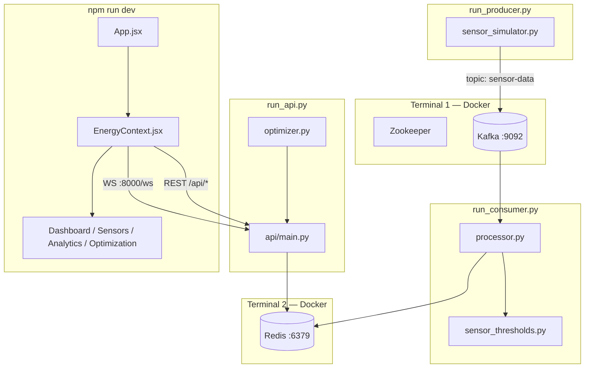

# VoltAI — Architecture & Code Logic Flow (File by File)

> Use this document to walk an interviewer through the project: **what runs first → what each file does → how data transforms at every step**.

---

## How to Use This in an Interview

1. Start with **Section 1** (one-sentence story + diagram).
2. Walk **Section 2** (startup order — shows you ran it).
3. Follow **Section 3** left-to-right: Ingest → Stream → Serve → UI.
4. When asked "what happens to one sensor reading?", use **Section 4** (single-message journey).
5. Keep **Section 5** open as a quick file index.

**Opening line you can memorize:**

> "VoltAI is a four-layer pipeline: a simulator publishes 300 sensor readings to Kafka, a stream processor enriches them with rules and ML and writes to Redis, FastAPI serves that state over REST and WebSocket, and React polls plus subscribes for a live dashboard."

---

## 1. System Overview



### Layers

| Layer | Responsibility | Key files |
|-------|----------------|-----------|
| **Infrastructure** | Message bus + cache | Docker: Kafka, Redis |
| **Ingestion** | Generate & publish telemetry | `run_producer.py`, `sensor_simulator.py` |
| **Processing** | Classify, score, store | `run_consumer.py`, `processor.py`, `sensor_thresholds.py` |
| **Serving** | REST + WebSocket API | `run_api.py`, `api/main.py`, `optimizer.py` |
| **Presentation** | Live dashboard | `App.jsx`, `EnergyContext.jsx`, components |

---

## 2. Startup Order (What You Run)

| Order | Command | File that starts | Connects to |
|-------|---------|------------------|-------------|
| 1 | `docker compose ... up zookeeper kafka` | `deployment/docker-compose-producer.yml` | Kafka on `:9092` |
| 2 | `docker run/start iot-redis` | — | Redis on `:6379` |
| 3 | `python run_producer.py` | → `SensorSimulator.generate_sensor_data()` | Kafka |
| 4 | `python run_consumer.py` | → `StreamProcessor.process_stream()` | Kafka + Redis |
| 5 | `python run_api.py` | → `uvicorn` + `api/main.py` | Redis |
| 6 | `npm run dev` | → `main.jsx` → `App.jsx` | API `:8000`, WS `:8000/ws` |

**Alternative:** `python main.py` runs producer + consumer + API in **three daemon threads** (dev convenience only).

**Environment variables:**

```
KAFKA_BROKER=127.0.0.1:9092
REDIS_HOST=127.0.0.1
HOST_IP=127.0.0.1          # Kafka advertised listener in Docker
```

---

## 3. File-by-File Logic Flow

Follow this order when explaining architecture.

---

### PHASE A — Infrastructure

#### `deployment/docker-compose-producer.yml`

**What it does:** Starts Zookeeper + Kafka for local development.

**Logic:**
- Kafka listens on `9092`
- `KAFKA_ADVERTISED_LISTENERS` uses `${HOST_IP}` so your host machine can connect
- Optional `sensor-simulator` container can run the producer inside Docker

**Say in interview:** "Kafka decouples ingestion from processing — the producer and consumer can scale and restart independently."

---

### PHASE B — Data Ingestion (Producer Side)

#### `backend/run_producer.py`

```
Entry point (7 lines)
    └── imports SensorSimulator
    └── simulator = SensorSimulator()
    └── simulator.generate_sensor_data()   # infinite loop
```

**Role:** Thin launcher. No business logic here.

---

#### `backend/src/data_simulator/sensor_simulator.py`

**Role:** Simulates 300 factory sensors and publishes JSON readings to Kafka topic `sensor-data`.

**Class:** `SensorSimulator`

| Method | Logic |
|--------|-------|
| `__init__` | Read `KAFKA_BROKER` (default `localhost:9092`), create Kafka producer, init 300 sensors |
| `_initialize_kafka_producer()` | `KafkaProducer` with `acks='all'`, retry up to 30× every 2s |
| `_initialize_sensors()` | Create `sensor_000`…`sensor_299` with device type, location, baselines |
| `generate_sensor_data()` | **Main loop:** for each sensor → reading → batch of 50 → Kafka → sleep 2–10s |
| `_generate_sensor_reading(sensor)` | Apply time-of-day multiplier + 2%/6% anomaly injection + energy formula |
| `_send_batch(batch)` | `producer.send('sensor-data', key=sensor_id, value=JSON)` then `flush()` |

**Energy formula (core):**

```
energy_consumption = current × voltage / 1000 × power_factor
```

**Time behavior:**
- Weekday 06:00–18:00 → load × `uniform(1.0, 1.3)`
- Night/weekend → load × `uniform(0.3, 0.8)`

**Before publish:** calls `apply_threshold_classification(reading)` from `sensor_thresholds.py` so raw bands exist at ingest time.

**Kafka message:**
- **Topic:** `sensor-data`
- **Key:** `sensor_id` (bytes) — same sensor always same partition
- **Value:** JSON reading dict

---

#### `backend/src/sensor_thresholds.py` *(used at producer AND processor)*

**Role:** Explainable health classification — the "rules engine."

**Flow:**

```
build_threshold_bands(data)
    ├── classify each of 6 metrics → LOW | MEDIUM | HIGH | CRITICAL
    ├── compute ratios (load %, voltage ratio, energy %, pressure %)
    └── return bands + ratios + baselines

_aggregate_operational_status(bands)
    ├── map each band → severity (0, 1, or 2)
    ├── LOW temp/current/energy = severity 0 (idle is OK)
    └── worst severity → status: normal | warning | critical

apply_threshold_classification(data)
    └── mutates data with: threshold_bands, threshold_ratios, status, is_anomaly
```

**Key interview point:** A cold motor at 15°C is **not** critical — LOW temperature means idle, not failure.

**Exported for API:** `thresholds_spec()` → served at `GET /api/thresholds/spec`

---

### PHASE C — Stream Processing (Consumer Side)

#### `backend/run_consumer.py`

```
Entry point (7 lines)
    └── imports StreamProcessor
    └── processor = StreamProcessor()
    └── processor.process_stream()   # infinite loop
```

---

#### `backend/src/stream_processor/processor.py`

**Role:** Consumes Kafka, runs ML, computes failure risk, writes Redis.

**Class:** `StreamProcessor`

| Method | Logic |
|--------|-------|
| `__init__` | Create Kafka consumer, Redis client, train Isolation Forest |
| `_create_consumer()` | `KafkaConsumer('sensor-data', group_id='energy-monitor-group', poll mode)` |
| `_train_anomaly_model()` | Fit Isolation Forest on 1000 synthetic normal samples |
| `process_stream()` | **Main loop:** `poll(max_records=200)` → process each message |
| `_calculate_failure_probability()` | Blend worst band + status floor + ML boost |
| `_store_sensor_data()` | Write to Redis keys + update dashboard hash |

**Per-message pipeline (in order):**

```
1. data = message.value                          # JSON from Kafka
2. apply_threshold_classification(data)          # refresh bands/status
3. features = [current, temperature, pressure]
4. StandardScaler.transform(features)
5. ml_anomaly = IsolationForest.predict == -1
6. anomaly_score = decision_function
7. failure_probability = _calculate_failure_probability(...)
8. data.update({ ml_anomaly, anomaly_score, failure_probability, processed_at })
9. _store_sensor_data(data)                      # → Redis
```

**Failure probability logic:**

```
worst band rank: LOW=0, MEDIUM=1, HIGH=2, CRITICAL=3
base = {0:0.05, 1:0.18, 2:0.42, 3:0.68}[worst]
if status critical → base = max(base, 0.55)
if status warning  → base = max(base, 0.28)
if ml_anomaly      → base += (anomaly_score + 0.1) × 0.25
failure_probability = min(base, 1.0)
```

**Redis writes (`_store_sensor_data`):**

| Key | Action |
|-----|--------|
| `sensor:{id}` | `SETEX 600` — full JSON snapshot |
| `location:{loc}:sensors` | `SADD` sensor id |
| `device_type:{type}:sensors` | `SADD` sensor id |
| `dashboard:stats` | `HINCRBYFLOAT total_energy`, `HINCRBY total_readings` |
| `alerts:critical` / `alerts:warning` | `SADD` if status matches |

---

### PHASE D — API & Optimization (Serving Layer)

#### `backend/run_api.py`

```
uvicorn.run(app, host=config.API_HOST, port=config.API_PORT)
    └── app imported from src.api.main
```

---

#### `backend/src/api/main.py`

**Role:** FastAPI app — reads Redis, exposes REST + WebSocket.

**Startup objects:**
- `get_redis_client()` — connects using `REDIS_HOST` (default `redis` in Docker, `127.0.0.1` locally)
- `ConnectionManager` — tracks WebSocket clients
- `optimizer = EnergyOptimizer()` — singleton for suggestions

**Request flow (typical REST call):**

```
Client GET /api/sensors
    └── get_redis_client()
    └── redis.keys("sensor:*")
    └── for each key: json.loads(redis.get(key))
    └── return { sensors, count }
```

**Endpoints:**

| Route | Reads from | Returns |
|-------|------------|---------|
| `GET /health` | Redis ping | healthy / 503 |
| `GET /api/sensors` | `sensor:*` keys | All live snapshots |
| `GET /api/sensors/{id}` | `sensor:{id}` | One sensor or 404 |
| `GET /api/dashboard/stats` | `dashboard:stats` hash + live sensor scan | KPIs, anomaly count |
| `GET /api/optimization/suggestions` | All sensors → `optimizer.generate_suggestions()` | Cost-saving cards |
| `GET /api/analytics/history` | Stats + synthetic time series | Chart data (demo) |
| `GET /api/thresholds/spec` | `thresholds_spec()` | Band definitions |
| `WS /ws` | Stats every 5s | `{type, data}` JSON |

**WebSocket loop:**

```
accept connection
send initial_data (dashboard stats)
loop:
    receive_text()        # client keepalive
    sleep 5 seconds
    send stats_update
```

---

#### `backend/src/ml_models/optimizer.py`

**Role:** On-demand cost-saving engine (not a background worker).

**Class:** `EnergyOptimizer`

**Called by:** `GET /api/optimization/suggestions` with current sensor list from Redis.

**Flow:**

```
generate_suggestions(sensors)
    ├── _generate_peak_suggestions()        # top 25% energy, shift off peak
    ├── _generate_maintenance_suggestions() # failure_probability > 0.7
    ├── _generate_efficiency_suggestions()  # energy > 130% fleet mean
    ├── _generate_operational_suggestions() # night shutdown for low-usage devices
    └── _diversify_suggestions(limit=15)    # round-robin mix for UI
```

**Tariff constants:**

| Period | Rate |
|--------|------|
| Off-peak | $0.08/kWh |
| Shoulder | $0.12/kWh |
| On-peak (9–17) | $0.18/kWh |

**Peak shift savings example:**

```
potential_savings = energy_consumption × (0.18 - 0.08)
action = schedule_shift
```

---

#### `backend/src/utils/config.py`

**Role:** Central env defaults (`KAFKA_BROKER`, `REDIS_HOST`, `API_PORT`, etc.).

**Used by:** `run_api.py` primarily. Simulator and processor read env vars directly.

---

#### `backend/main.py` *(optional — all-in-one dev mode)*

**Role:** Starts simulator + processor + API in three `threading.Thread` daemons, then runs uvicorn.

**Not used in production-style multi-terminal setup.**

---

### PHASE E — Frontend (Presentation Layer)

#### `frontend/index.html` → `frontend/src/main.jsx`

```
ReactDOM.createRoot(#root).render(<App />)
```

---

#### `frontend/vite.config.js`

**Role:** Dev server on port 3000; proxies `/api/*` → `http://localhost:8000`.

**Note:** WebSocket connects directly to `:8000/ws` (not proxied).

---

#### `frontend/src/App.jsx`

**Role:** App shell + tab navigation.

```
ThemeProvider
  └── EnergyProvider
        ├── Navbar (tabs: dashboard | sensors | analytics | optimization)
        ├── renderContent() → active tab component
        └── footer
```

**No react-router** — tab state is local `useState('dashboard')`.

---

#### `frontend/src/context/EnergyContext.jsx`

**Role:** Global data hub — WebSocket + REST polling + state.

**State:**

| State | Contents |
|-------|----------|
| `realTimeData` | `{ stats, sensors, alerts }` |
| `optimizationSuggestions` | Optimizer cards |
| `historicalData` | Analytics chart series |
| `isConnected` | WebSocket status |

**On mount:**

```
connectWebSocket()     → ws://hostname:8000/ws
fetchInitialData()     → sensors(50) + suggestions + history(24h)
setInterval 8s         → sync stats + sensors(500) + suggestions
```

**WebSocket handlers:**

| Message type | Action |
|--------------|--------|
| `initial_data` | Update stats |
| `stats_update` | Update stats |
| `critical_alert` | Update alerts (backend rarely sends this) |

**`normalizeDashboardStats()`:** Merges API stats with live sensor rows; computes `efficiency_score` via `utils/efficiencyScore.js`.

---

#### `frontend/src/context/ThemeContext.jsx`

**Role:** Dark/light toggle → `document.documentElement` class + `localStorage`.

---

#### `frontend/src/components/Dashboard.jsx`

**Reads:** `useEnergy()` → `realTimeData.stats`, `realTimeData.sensors`

**Renders:**
- 6 KPI stat cards (energy, alerts, sensors, efficiency, temp, hourly cost)
- `RealTimeChart` — Canvas chart, samples fleet mean every 1.2s
- Critical alerts list (top 5 critical sensors)
- `AnomalyMap` — 9 factory zones, health % from sensor status

---

#### `frontend/src/components/SensorGrid.jsx`

**Reads:** `realTimeData.sensors`

**Features:** Search, filter by status/location, pagination (12/page), shutdown modal (simulated via `controlDevice()`)

---

#### `frontend/src/components/Analytics.jsx`

**Reads:** `historicalData` from context; refetches on time range change (6h / 24h / 7d)

**Renders:** 4 summary cards + tabbed Canvas charts (energy / efficiency / active sensors) + CSV export

**Trend %:** `utils/trendPercent.js` — `(last - first) / |first| × 100`

---

#### `frontend/src/components/Optimization.jsx`

**Reads:** `optimizationSuggestions`

**Features:** Priority filters, Auto-Optimize (25s refresh), Apply/Schedule modals, savings projections using tariff rates

---

#### `frontend/src/utils/efficiencyScore.js`

**Role:** Client-side efficiency score when API field is stale:

```
statusWeighted = (normal×99 + warning×95 + critical×90) / n
anomalyPenalty = min(6, (anomaly/n) × 10)
score = clamp(statusWeighted - anomalyPenalty, 90, 99.8)
```

---

## 4. Single Message Journey (Tell This Story)

**One reading from sensor_042, start to finish:**

```
STEP 1 — GENERATE (sensor_simulator.py)
  _generate_sensor_reading()
  → current=45A, temp=62°C, pressure=8bar, voltage=218V
  → energy = 45 × 218 / 1000 × 0.91 = 8.97 kWh
  → apply_threshold_classification() → status="warning", bands={...}

STEP 2 — PUBLISH (sensor_simulator.py)
  producer.send('sensor-data', key=b'sensor_042', value=JSON)
  → Kafka partition determined by sensor_id hash

STEP 3 — CONSUME (processor.py)
  consumer.poll() → message.value = JSON dict

STEP 4 — RE-CLASSIFY (sensor_thresholds.py)
  apply_threshold_classification(data)  # ensures bands fresh

STEP 5 — ML SCORE (processor.py)
  IsolationForest on [45, 62, 8] → ml_anomaly=False, anomaly_score=-0.12

STEP 6 — FAILURE RISK (processor.py)
  worst band HIGH → base=0.42, status warning → 0.42
  → failure_probability = 0.42 (42%)

STEP 7 — REDIS (processor.py)
  SETEX sensor:sensor_042 600 "{full JSON}"
  HINCRBYFLOAT dashboard:stats total_energy 8.97
  SADD alerts:warning sensor_042

STEP 8 — API (api/main.py)
  GET /api/sensors → reads sensor:sensor_042 from Redis
  GET /api/optimization/suggestions → optimizer sees failure_prob=0.42

STEP 9 — UI (EnergyContext.jsx → Dashboard)
  8s poll fetches sensor list
  WebSocket pushes updated stats
  Dashboard shows sensor in alerts if status=critical/warning
```

---

## 5. File Index (Quick Lookup)

### Backend

| File | One-line purpose |
|------|------------------|
| `run_producer.py` | Start simulator |
| `run_consumer.py` | Start stream processor |
| `run_api.py` | Start FastAPI |
| `main.py` | All-in-one dev launcher |
| `data_simulator/sensor_simulator.py` | 300-sensor sim + Kafka publish |
| `sensor_thresholds.py` | Band rules + status aggregation |
| `stream_processor/processor.py` | Kafka consume → ML → Redis |
| `ml_models/optimizer.py` | Cost-saving suggestions |
| `api/main.py` | REST + WebSocket |
| `utils/config.py` | Env var defaults |

### Frontend

| File | One-line purpose |
|------|------------------|
| `main.jsx` | React entry |
| `App.jsx` | Tab shell + providers |
| `context/EnergyContext.jsx` | Global state, WS, polling |
| `context/ThemeContext.jsx` | Dark/light theme |
| `components/Dashboard.jsx` | KPIs + live chart + alerts |
| `components/SensorGrid.jsx` | Sensor table/cards |
| `components/Analytics.jsx` | Historical charts |
| `components/Optimization.jsx` | Savings suggestions |
| `components/RealTimeChart.jsx` | Canvas live energy chart |
| `components/AnomalyMap.jsx` | Factory zone health map |
| `utils/efficiencyScore.js` | Efficiency calculation |
| `utils/trendPercent.js` | Trend % for analytics |
| `vite.config.js` | Dev server + API proxy |

### Infrastructure

| File | One-line purpose |
|------|------------------|
| `deployment/docker-compose-producer.yml` | Kafka + Zookeeper |
| `deployment/docker-compose-consumer.yml` | Full stack in Docker (optional) |

---

## 6. Architecture Q&A (Short Answers)

**Q: Why Kafka between simulator and processor?**  
Decoupling. Producer and consumer restart independently; Kafka buffers if processor is slow; consumer groups enable horizontal scale.

**Q: Why Redis between processor and API?**  
API needs fast "current state" reads. Kafka is an event log, not a query database. Redis gives O(1) GET per sensor.

**Q: Why classify thresholds twice (producer + processor)?**  
Producer adds bands early for debugging/visibility. Processor re-applies to ensure consistency after any pipeline changes. Same function both times.

**Q: Why Isolation Forest if you already have rules?**  
Rules catch single-metric violations. ML catches multivariate outliers (slightly high current + temp + pressure together) that no single rule triggers.

**Q: Why WebSocket + REST polling?**  
WebSocket pushes lightweight stats. Full 300-sensor fleet via WS would be heavy; 8s REST poll keeps sensor grid fresh.

**Q: Where is optimization computed?**  
On-demand in `optimizer.py` when API receives `GET /api/optimization/suggestions` — reads live Redis state, no separate background job.

---

## 7. Interview Walkthrough Script (3 Minutes)

Use this verbatim flow:

1. **"Infrastructure first"** — Docker runs Kafka and Redis.

2. **"Ingestion"** — `run_producer.py` starts `SensorSimulator`. It loops 300 sensors, generates physics-based readings with day/night patterns, classifies bands via `sensor_thresholds.py`, and publishes JSON to Kafka topic `sensor-data` keyed by sensor ID.

3. **"Processing"** — `run_consumer.py` starts `StreamProcessor`. It polls Kafka, re-applies thresholds, runs Isolation Forest on current/temp/pressure, computes failure probability, and writes enriched JSON to Redis with a 600-second TTL.

4. **"Serving"** — `run_api.py` starts FastAPI. Routes read Redis — sensors, dashboard stats, optimization suggestions from the optimizer engine. WebSocket pushes stats every 5 seconds.

5. **"UI"** — React app wraps everything in `EnergyContext`. WebSocket for stats, REST every 8 seconds for the full sensor fleet. Four tabs: Dashboard, Sensors, Analytics, Optimization.

6. **"Design principle"** — Every alert is explainable via threshold bands exposed at `/api/thresholds/spec`. ML boosts failure risk but never silently overrides rules.

---

## 8. Data Shape Reference

### After simulator (Kafka value)

```json
{
  "sensor_id": "sensor_042",
  "current": 45.2,
  "temperature": 62.5,
  "pressure": 8.1,
  "voltage": 218.0,
  "energy_consumption": 8.97,
  "threshold_bands": { "...": "MEDIUM" },
  "status": "warning",
  "is_anomaly": true
}
```

### After processor (Redis value — adds)

```json
{
  "ml_anomaly": false,
  "anomaly_score": -0.12,
  "failure_probability": 0.42,
  "processed_at": "2026-06-26T10:30:01.123Z"
}
```

---

*Aligned with current codebase after cleanup: single producer in `data_simulator/`, single consumer in `stream_processor/`.*
