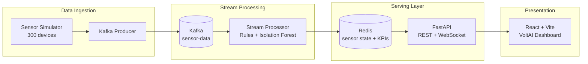

# VoltAI — Complete Interview Preparation Guide

> **Purpose:** Everything you need to confidently explain this project in technical interviews — architecture, formulas, design decisions, demo flow, tough follow-ups, and honest trade-offs.

**Project:** VoltAI (IoT Energy Monitor)  
**One-liner:** Real-time industrial energy monitoring with explainable health scoring, ML anomaly detection, and tariff-aware optimization across 300 simulated factory sensors.

---

## Table of Contents

1. [30-Second & 2-Minute Elevator Pitches](#1-30-second--2-minute-elevator-pitches)
2. [Architecture & Data Flow](#2-architecture--data-flow)
3. [Tech Stack — Why Each Choice](#3-tech-stack--why-each-choice)
4. [Backend Deep Dive](#4-backend-deep-dive)
5. [Threshold & Health Scoring (Explainability)](#5-threshold--health-scoring-explainability)
6. [ML & Anomaly Detection](#6-ml--anomaly-detection)
7. [Failure Probability Scoring](#7-failure-probability-scoring)
8. [Optimization Engine](#8-optimization-engine)
9. [Kafka & Stream Processing](#9-kafka--stream-processing)
10. [Redis & Caching Strategy](#10-redis--caching-strategy)
11. [API & WebSocket Design](#11-api--websocket-design)
12. [Frontend Architecture](#12-frontend-architecture)
13. [Demo Walkthrough Script (5–8 min)](#13-demo-walkthrough-script-58-min)
14. [System Design Interview Questions](#14-system-design-interview-questions)
15. [Backend / Python Questions](#15-backend--python-questions)
16. [Data Science / ML Questions](#16-data-science--ml-questions)
17. [Frontend / React Questions](#17-frontend--react-questions)
18. [DevOps & Infrastructure Questions](#18-devops--infrastructure-questions)
19. [Behavioral & Project Story Questions](#19-behavioral--project-story-questions)
20. [Tough Follow-Ups & Honest Answers](#20-tough-follow-ups--honest-answers)
21. [Production Roadmap (What You'd Do Next)](#21-production-roadmap-what-youd-do-next)
22. [Quick Reference Cheat Sheet](#22-quick-reference-cheat-sheet)
23. [Glossary](#23-glossary)

---

## 1. 30-Second & 2-Minute Elevator Pitches

### 30-Second Pitch

> "I built **VoltAI**, an end-to-end IoT energy monitoring platform for industrial factories. Three hundred sensors stream telemetry through **Kafka**, a stream processor applies **research-aligned threshold rules** plus **Isolation Forest anomaly detection**, results land in **Redis**, and a **FastAPI + React** dashboard gives operators live KPIs, failure risk scores, and **tariff-aware cost-saving recommendations**. The key design choice is **explainability** — every alert maps to auditable band rules, and ML only *boosts* risk, it never silently overrides rules."

### 2-Minute Pitch

> "Factories lose money when equipment runs inefficiently, fails without warning, or draws power during expensive peak tariffs. VoltAI solves this with a **production-style streaming stack**.
>
> **Ingestion:** A simulator generates realistic readings for 300 devices — motors, pumps, furnaces — across seven factory zones, with day/night load patterns and ~8% injected anomalies.
>
> **Streaming:** Readings go to Kafka topic `sensor-data`, keyed by `sensor_id` for ordered per-device processing.
>
> **Processing:** The stream processor classifies six metrics into LOW/MEDIUM/HIGH/CRITICAL bands using industrial-style thresholds — ISO 10816 vibration, IEC voltage windows, load as % of rated current. It runs Isolation Forest on `[current, temperature, pressure]` and computes a 0–100% failure probability that blends rule severity with ML support.
>
> **Serving:** Enriched state is cached in Redis (600s TTL per sensor). FastAPI exposes REST + WebSocket. The React dashboard shows live charts, critical alerts, zone health maps, and an optimizer that suggests peak-shaving, predictive maintenance, efficiency audits, and night shutdowns — each with **$/hour savings** backed by transparent formulas.
>
> **Why it matters:** I can walk through any number on screen and point to the exact code path that produced it. That's deliberate — explainability beats black-box ML in operations settings."

---

## 2. Architecture & Data Flow

### High-Level Diagram



### End-to-End Data Flow (Step by Step)

| Step | Component | What Happens |
|------|-----------|--------------|
| 1 | `sensor_simulator.py` | Generates reading for each of 300 sensors every 2–10s |
| 2 | Producer | Applies threshold classification, publishes JSON to Kafka |
| 3 | Kafka | Topic `sensor-data`, key = `sensor_id` (partition affinity) |
| 4 | `processor.py` | Consumes batch (up to 200 records), enriches with ML + failure risk |
| 5 | Redis | `SETEX sensor:{id} 600` — latest snapshot per sensor |
| 6 | FastAPI | Reads Redis, serves REST + WebSocket |
| 7 | React | Polls REST every 8s + WebSocket for stats push |

### Message Payload Shape (After Full Pipeline)

```json
{
  "timestamp": "2026-06-26T10:30:00.000Z",
  "sensor_id": "sensor_042",
  "device_type": "motor",
  "location": "production_floor_a",
  "current": 45.2,
  "temperature": 62.5,
  "pressure": 8.1,
  "voltage": 218.0,
  "vibration": 3.2,
  "power_factor": 0.91,
  "energy_consumption": 8.97,
  "rated_current": 120.0,
  "nominal_voltage": 220.0,
  "operating_pressure": 10.0,
  "energy_baseline_kwh": 7.5,
  "threshold_bands": {
    "temperature": "MEDIUM",
    "current": "MEDIUM",
    "voltage": "MEDIUM",
    "vibration": "MEDIUM",
    "energy": "HIGH",
    "pressure": "MEDIUM"
  },
  "threshold_ratios": {
    "current_load_pct": 37.7,
    "voltage_ratio_nominal": 0.99,
    "energy_ratio_pct": 119.6,
    "pressure_ratio_pct": 81.0
  },
  "status": "warning",
  "is_anomaly": true,
  "ml_anomaly": false,
  "anomaly_score": -0.12,
  "failure_probability": 0.42,
  "processed_at": "2026-06-26T10:30:01.123Z"
}
```

### Entry Points (How Services Start)

| Script | Role | Port / Target |
|--------|------|---------------|
| `run_producer.py` | Sensor simulator → Kafka | `KAFKA_BROKER=127.0.0.1:9092` |
| `run_consumer.py` | Stream processor → Redis | Kafka + `REDIS_HOST=127.0.0.1` |
| `run_api.py` | FastAPI server | `:8000` |
| `npm run dev` (frontend) | React dashboard | `:3000` |

---

## 3. Tech Stack — Why Each Choice

| Layer | Technology | Interview Answer — "Why?" |
|-------|------------|---------------------------|
| **Message bus** | Apache Kafka | Decouples ingest from processing; handles 300 sensors × continuous stream; enables horizontal scaling via consumer groups; replay for debugging |
| **Stream processing** | Python (custom) | Fast iteration for rules + ML in one process; good for portfolio/demo scale; would move to Flink/Spark at 10K+ sensors |
| **Cache** | Redis | Sub-ms reads for API; TTL-based freshness; hash for aggregated KPIs; sets for alert indexing |
| **API** | FastAPI | Async-native, auto OpenAPI docs, WebSocket support, Pydantic validation |
| **ML** | scikit-learn Isolation Forest | Unsupervised — no labeled failure data needed; fast inference; interpretable alongside rules |
| **Frontend** | React 18 + Vite | Component model for dashboard tabs; Vite for fast HMR during development |
| **Charts** | Custom Canvas | Full control, no chart library bundle; trade-off: no built-in accessibility |
| **Infra** | Docker Compose | Kafka + Zookeeper locally without manual install |

---

## 4. Backend Deep Dive

### Project Structure

```
backend/
├── run_producer.py          # Entry: starts sensor simulator
├── run_consumer.py          # Entry: starts stream processor
├── run_api.py               # Entry: starts FastAPI (uvicorn)
└── src/
    ├── data_simulator/
    │   └── sensor_simulator.py   # 300-sensor telemetry generator + Kafka producer
    ├── stream_processor/
    │   └── processor.py          # Core: consume → classify → ML → Redis
    ├── ml_models/
    │   └── optimizer.py          # Tariff-aware cost-saving engine
    ├── sensor_thresholds.py      # All band definitions + status logic
    ├── api/
    │   └── main.py               # REST routes + WebSocket
    └── utils/
        └── config.py             # Environment variable defaults
```

### Sensor Simulator — What It Models

**Fleet:** 300 sensors, IDs `sensor_000` … `sensor_299`

**Device types (7):** motor, compressor, conveyor, furnace, pump, cooling_tower, hvac_unit

**Locations (7):** production_floor_a/b, warehouse, assembly_line, packaging, utility_room, roof

**Time-of-day behavior:**
- Weekday 06:00–18:00: load multiplier `uniform(1.0, 1.3)` — peak production
- Night/weekend: `uniform(0.3, 0.8)` — reduced load

**Anomaly injection (probabilistic):**
| Probability | Type | Effect |
|-------------|------|--------|
| 2% | Severe | Current × 1.8–3.0, temp × 1.5–2.5, vibration 5.5–9.0 mm/s |
| 6% | Elevated | Milder multipliers |
| 92% | Normal | Tight bands around base values |

**Energy formula (every reading):**

```
energy_consumption (kWh) = current_A × voltage_V / 1000 × power_factor
```

**Energy baseline (scales with time — prevents false CRITICAL at night):**

```
energy_baseline_kwh = (base_current × nominal_voltage / 1000) × time_multiplier × 1.05
```

**Why baseline scales:** Without this, night readings would always look "efficient" and day readings "critical" relative to a static baseline — a deliberate domain fix.

### Core Processing Pipeline (`processor.py`)

For **each Kafka message**, in order:

1. **Rule classification** — `apply_threshold_classification()` → `status`, `threshold_bands`, `is_anomaly`
2. **ML scoring** — Isolation Forest on `[current, temperature, pressure]` → `ml_anomaly`, `anomaly_score`
3. **Failure probability** — blend bands + status floor + ML boost
4. **Redis write** — `SETEX sensor:{id} 600` + update aggregates
5. **Alert indexing** — `SADD alerts:critical` or `alerts:warning` if applicable

---

## 5. Threshold & Health Scoring (Explainability)

**Source file:** `backend/src/sensor_thresholds.py`

### Design Philosophy

> "We don't use a naive rule like 'any CRITICAL metric → sensor is critical.' Low temperature means idle equipment, not failure. Low current means light load, not overload. We map each band to a **severity contribution** and take the worst."

### Exact Band Thresholds

#### Temperature (°C) — Absolute

| Band | Range |
|------|-------|
| LOW | T < 20 |
| MEDIUM | 20 ≤ T < 60 |
| HIGH | 60 ≤ T < 80 |
| CRITICAL | T ≥ 80 |

#### Current — % of Rated Current

```
load_pct = 100 × (current_A / rated_current_A)
```

| Band | Range |
|------|-------|
| LOW | < 40% |
| MEDIUM | 40–70% |
| HIGH | 70–90% |
| CRITICAL | ≥ 90% |

#### Voltage — Ratio vs Nominal (IEC-style)

```
voltage_ratio = voltage_V / nominal_voltage_V   (typically 220V)
```

| Band | Condition |
|------|-----------|
| CRITICAL | ratio < 0.85 **OR** ratio > 1.20 |
| LOW | ratio < 0.90 |
| MEDIUM | 0.90 ≤ ratio ≤ 1.10 |
| HIGH | 1.10 < ratio ≤ 1.20 |

#### Vibration (mm/s) — ISO 10816 Style

| Band | Range |
|------|-------|
| LOW | < 1.8 |
| MEDIUM | 1.8 – 4.5 |
| HIGH | 4.5 – 7.1 |
| CRITICAL | ≥ 7.1 |

#### Energy — % of Baseline kWh

```
energy_pct = 100 × (energy_consumption / energy_baseline_kwh)
```

| Band | Range |
|------|-------|
| LOW | < 70% |
| MEDIUM | 70–110% |
| HIGH | 110–130% |
| CRITICAL | ≥ 130% |

#### Pressure — % of Operating Setpoint

```
pressure_pct = 100 × (pressure_bar / operating_pressure_bar)
```

| Band | Range |
|------|-------|
| LOW | < 60% |
| MEDIUM | 60–100% |
| HIGH | 100–120% |
| CRITICAL | ≥ 120% |

### Overall Status Aggregation

Each metric band maps to a **severity score**:

| Band | Severity (temp, current, energy, vibration) | Severity (voltage LOW, pressure LOW) |
|------|---------------------------------------------|--------------------------------------|
| LOW | 0 | 1 |
| MEDIUM | 0 | 0 |
| HIGH | 1 | 1 |
| CRITICAL | 2 | 2 |

```
worst_severity = max(severity across all 6 metrics)

if worst_severity >= 2 → status = "critical"
elif worst_severity >= 1 → status = "warning"
else                    → status = "normal"

is_anomaly = status in ("warning", "critical")
```

**Interview example:** A motor at 15°C with low current shows temperature LOW and current LOW — both severity 0 → status **normal**, even though temperature is "cold." This avoids false alarms on idle equipment.

**Explainability API:** `GET /api/thresholds/spec` returns all band edges for UI/tooling — auditors can verify any classification.

---

## 6. ML & Anomaly Detection

### Algorithm: Isolation Forest (scikit-learn)

**Why Isolation Forest?**
- **Unsupervised** — no labeled failure dataset required
- **Fast** — O(n) training, fast inference per message
- **Complements rules** — catches multivariate outliers rules miss (e.g., slightly elevated current + temp + pressure together)
- **Does NOT override rules** — stored separately as `ml_anomaly`

### Configuration

```python
IsolationForest(
    contamination=0.1,      # expect ~10% outliers
    random_state=42,
    n_estimators=100
)
```

### Features (3-dimensional)

```
X = [current, temperature, pressure]
```

### Training (at processor startup — synthetic)

```python
np.random.seed(42)
n_samples = 1000
current  ~ Normal(25, 10)
temp     ~ Normal(30, 5)
pressure ~ Normal(5, 2)
```

**Honest caveat:** Model is trained on synthetic Gaussians, not live fleet data. Good for demo; production would retrain on historical normal operations.

### Preprocessing

```python
StandardScaler — partial_fit on first message, transform every subsequent message
```

### Scoring

```python
predict(x_scaled) == -1  →  ml_anomaly = True
anomaly_score = decision_function(x_scaled)[0]   # more negative = more anomalous
```

### Dual Anomaly Signals (Important Distinction)

| Field | Source | Meaning |
|-------|--------|---------|
| `is_anomaly` | Rule-based thresholds | Operational alert — auditable bands |
| `ml_anomaly` | Isolation Forest | Statistical outlier — multivariate pattern |
| `failure_probability` | Both | Blended interpretable score |

**Interview answer:** "ML augments, not replaces. Operators see band reasons in the UI; ML adds a boost to failure probability when statistical patterns diverge from normal."

---

## 7. Failure Probability Scoring

### Formula (Step by Step)

**Step 1 — Worst band rank across all 6 metrics:**

```
rank: LOW=0, MEDIUM=1, HIGH=2, CRITICAL=3
worst = max(rank across threshold_bands)
```

**Step 2 — Base score from worst band:**

| Worst Band | Base Score |
|------------|------------|
| LOW (0) | 0.05 |
| MEDIUM (1) | 0.18 |
| HIGH (2) | 0.42 |
| CRITICAL (3) | 0.68 |

**Step 3 — Status floor (operational context):**

```
if status == "critical": base_score = max(base_score, 0.55)
if status == "warning":  base_score = max(base_score, 0.28)
```

**Step 4 — ML boost:**

```
if ml_anomaly:
    base_score += max(0, (anomaly_score + 0.1) × 0.25)
```

**Step 5 — Cap:**

```
failure_probability = min(base_score, 1.0)
```

**UI display:** `Failure Risk % = failure_probability × 100`

### Worked Example

Sensor with:
- Bands: temp=MEDIUM, current=HIGH, voltage=MEDIUM, vibration=LOW, energy=HIGH, pressure=MEDIUM
- worst rank = HIGH → 2 → base = 0.42
- status = "warning" → floor = max(0.42, 0.28) = 0.42
- ml_anomaly = True, anomaly_score = -0.3 → boost = max(0, (-0.3 + 0.1) × 0.25) = 0.05
- **failure_probability = 0.47 → 47%**

---

## 8. Optimization Engine

**Source file:** `backend/src/ml_models/optimizer.py`

### Tariff Model

| Period | Hours | Rate ($/kWh) |
|--------|-------|--------------|
| Off-peak | Outside peak | 0.08 |
| Shoulder | Transition | 0.12 |
| On-peak | 9:00–17:00 | 0.18 |

### Four Suggestion Types

#### 1. Cost Optimization — Peak Load Shifting

**Target:** Top 25% of sensors by `energy_consumption` (max 5 cards)

**During peak hours (9–17), if failure_probability < 0.4:**

```
potential_savings = energy_consumption × (0.18 - 0.08)   # on_peak - off_peak
current_cost      = energy_consumption × 0.18
savings_per_day   = potential_savings × 8 hours
action            = schedule_shift
priority          = high if savings > $2/hr else medium
```

**Off-peak (failure_probability < 0.5):**

```
potential_savings = energy_consumption × (0.12 - 0.08)   # shoulder - off_peak
```

#### 2. Predictive Maintenance

**Trigger:** `failure_probability > 0.7`

```
potential_savings = max(0.5, failure_probability × hourly_energy × 0.18)
urgency           = critical if failure_probability > 0.85 else high
action            = schedule_maintenance
```

**Risk factors identified:**
- `temperature > 75°C` → high_temperature
- `current > 70A` → high_current
- `pressure > 12 bar` → high_pressure
- `is_anomaly == True` → behavior_anomaly
- `status == 'critical'` → critical_status

#### 3. Energy Efficiency Audit

**Trigger:** `energy_consumption > 1.3 × fleet_mean` (top 8 sensors)

```
efficiency_ratio  = sensor_energy / avg_consumption
excess_kwh        = max(0, sensor_energy - avg)
potential_savings = max(0.5, excess_kwh × 0.12)
action            = efficiency_audit
priority          = high if ratio > 1.6 else medium
```

#### 4. Operational Optimization — Night Shutdown

**Target:** Sensors at or below 15th percentile energy consumption

**Night (hour < 6 or hour > 20), device types: pump, cooling_tower, conveyor:**

```
potential_savings = max(0.5, energy × 0.08 × 8)
action            = schedule_shutdown
priority          = low
```

**Diversification:** Output capped at 15 suggestions, round-robin across types so UI isn't dominated by one category.

---

## 9. Kafka & Stream Processing

### Topic & Message Format

| Property | Value |
|----------|-------|
| Topic | `sensor-data` |
| Key | `sensor_id` (UTF-8 bytes) — ensures per-sensor ordering in partition |
| Value | JSON serialized reading |
| Consumer group | `energy-monitor-group` |

### Producer Configuration

```python
KafkaProducer(
    bootstrap_servers=[kafka_broker],
    value_serializer=json.dumps → UTF-8,
    retries=5,
    acks='all',           # wait for all replicas
    linger_ms=100,        # micro-batching
    batch_size=16384
)
```

- Sends in batches of 50, then `flush()`
- 30 connection retry attempts × 2s sleep

### Consumer Configuration

```python
KafkaConsumer(
    'sensor-data',
    auto_offset_reset='earliest',
    group_id='energy-monitor-group',
    enable_auto_commit=True
)
```

- Uses **`poll(timeout_ms=1000, max_records=200)`** instead of iterator
- **Why poll?** Python 3.12 socket stability — pragmatic ops decision

### Interview Questions & Answers

**Q: Why Kafka instead of direct HTTP or a queue like RabbitMQ?**  
A: Kafka handles high-throughput continuous streams, retains messages for replay/debugging, and scales horizontally with consumer groups. RabbitMQ is better for task queues; Kafka is better for event streaming at scale.

**Q: Why key by sensor_id?**  
A: Partition affinity — all messages for one sensor go to the same partition, preserving order per device.

**Q: What happens if the consumer crashes?**  
A: Consumer group rebalances; another instance picks up partitions. `auto_offset_reset='earliest'` on fresh group; committed offsets on restart. Unprocessed messages replay from last commit.

**Q: How would you scale to 10,000 sensors?**  
A: Increase Kafka partitions; run multiple consumer instances in the same group; each handles a subset of partitions. Stream processor becomes the bottleneck — consider Flink or separate ML inference service.

---

## 10. Redis & Caching Strategy

### Key Schema

| Key | Type | TTL | Purpose |
|-----|------|-----|---------|
| `sensor:{sensor_id}` | String (JSON) | **600s** | Latest enriched snapshot |
| `location:{location}:sensors` | Set | None | Sensor IDs per zone |
| `device_type:{type}:sensors` | Set | None | Sensor IDs per device type |
| `dashboard:stats` | Hash | None | Cumulative `total_energy`, `total_readings` |
| `alerts:critical` | Set | None | Sensor IDs with critical status |
| `alerts:warning` | Set | None | Sensor IDs with warning status |

### Why 600s TTL?

- Sensors publish every 2–10s; 600s gives ~60–300 updates before expiry
- Stale sensors auto-expire — API won't show dead devices forever
- Memory bounded for 300 sensors (~300 keys × ~2KB ≈ 600KB)

### Interview Questions

**Q: Why Redis instead of querying Kafka directly from the API?**  
A: Kafka is an event log, not a database. Redis gives O(1) reads for "current state of sensor X" and aggregated KPIs. API latency stays sub-10ms.

**Q: What if Redis goes down?**  
A: API `/health` returns 503. Consumer keeps processing but writes fail — would need retry buffer or dead-letter queue in production.

**Q: Why not PostgreSQL?**  
A: For live dashboard state, Redis is faster. Production would add TimescaleDB/InfluxDB for historical time-series alongside Redis for hot state.

---

## 11. API & WebSocket Design

### REST Endpoints

| Method | Endpoint | Description |
|--------|----------|-------------|
| GET | `/health` | API + Redis connectivity |
| GET | `/api/sensors` | All live sensor snapshots |
| GET | `/api/sensors/{id}` | Single sensor detail |
| GET | `/api/dashboard/stats` | Aggregated KPIs |
| GET | `/api/optimization/suggestions?limit=10` | Cost-saving recommendations |
| GET | `/api/analytics/history?hours=24` | Chart time series |
| GET | `/api/thresholds/spec` | Band definitions (explainability) |
| WS | `/ws` | Live stats push |

### Dashboard Stats Response

```json
{
  "total_energy_consumption": 4521.3,
  "total_readings": 15420,
  "anomaly_count": 12,
  "average_consumption": 0.293,
  "status_normal": 275,
  "status_warning": 18,
  "status_critical": 7
}
```

### WebSocket Protocol

**Server behavior:**
1. Accept connection
2. Send `{type: "initial_data", data: <dashboard stats>}`
3. Loop: wait for client message → sleep 5s → send `{type: "stats_update", data: <stats>}`

**Client (`EnergyContext.jsx`):**
- Connects to `ws://{hostname}:8000/ws`
- Reconnects after 3s on disconnect
- Handles `initial_data`, `stats_update`, `critical_alert`

**Hybrid real-time strategy:**
- WebSocket pushes **dashboard stats** (lightweight)
- REST polls every **8 seconds** for full sensor fleet (500 sensors) + optimization suggestions
- RealTimeChart samples fleet mean every **1.2s** locally for smooth canvas animation

**Interview talking point:** "WebSocket alone doesn't push the full 300-sensor array — that would be expensive. Stats via WS, fleet via REST polling is a pragmatic hybrid."

---

## 12. Frontend Architecture

### Component Hierarchy

```
App (tab state: dashboard | sensors | analytics | optimization)
├── ThemeProvider
│   └── EnergyProvider (global data + WebSocket + API)
│       ├── Navbar (tabs, connection badge, theme toggle)
│       ├── Dashboard
│       │   ├── StatCard × 6 (energy, alerts, sensors, efficiency, temp, cost)
│       │   ├── RealTimeChart (Canvas, 1.2s sampling)
│       │   ├── Critical alerts list
│       │   └── AnomalyMap (9 factory zones)
│       ├── SensorGrid (search, filter, pagination, shutdown modal)
│       ├── Analytics (3 chart tabs, CSV export, trend cards)
│       └── Optimization (suggestions, apply/schedule modals, auto-optimize)
```

### State Management

**Context API** (not Redux) — appropriate for single global data domain:
- `EnergyContext` — sensors, stats, suggestions, history, WebSocket connection
- `ThemeContext` — dark/light mode, `localStorage` persistence

### Efficiency Score (Frontend Calculation)

**File:** `frontend/src/utils/efficiencyScore.js`

Mirrors backend when API returns stale values:

```
statusWeighted = (normal×99 + warning×95 + critical×90) / n
anomalyPenalty = min(6, (anomaly_count/n) × 10)
computed = statusWeighted - anomalyPenalty
baseline = explicit > 0 ? (explicit×0.35 + computed×0.65) : computed
efficiency_score = clamp(round(baseline, 1), 90, 99.8)
```

### Charts — Custom Canvas (Not Chart.js)

Despite Chart.js/Recharts in `package.json`, **all charts are hand-drawn HTML5 Canvas**:
- `RealTimeChart.jsx` — live fleet mean energy, 50-point rolling window
- `AnalyticsChart` (in `Analytics.jsx`) — historical bars with hover tooltips, ≤40 buckets

**Why Canvas?** Full rendering control, no library bundle. Trade-off: manual resize handling, no built-in accessibility.

### Key Demo Features

1. Live connection badge (WebSocket status)
2. 6 KPI stat cards with efficiency score
3. Real-time canvas chart updating every ~1.2s
4. Critical alerts panel (top 5)
5. Factory floor zone health map
6. Sensor grid with search/filter/pagination
7. Analytics with 3 chart tabs + CSV export
8. Optimization hub with apply/schedule modals and $/hour savings
9. Dark/light theme toggle

---

## 13. Demo Walkthrough Script (5–8 min)

### Before Demo — Verify Services

```bash
# Terminal 1: Kafka
cd deployment && export HOST_IP=127.0.0.1
docker compose -f docker-compose-producer.yml up -d zookeeper kafka

# Terminal 2: Redis
docker start iot-redis   # or docker run -d --name iot-redis -p 6379:6379 redis:alpine

# Terminal 3–5: Backend
cd backend && export KAFKA_BROKER=127.0.0.1:9092 && export REDIS_HOST=127.0.0.1
python run_producer.py    # Terminal 3
python run_consumer.py    # Terminal 4
python run_api.py         # Terminal 5

# Terminal 6: Frontend
cd frontend && npm run dev
```

Open: http://localhost:3000

### Demo Flow

**1. Dashboard (2 min)**
- Point to connection badge: "WebSocket connected to FastAPI"
- Stat cards: "Total energy aggregated from 300 sensors via Redis"
- Live chart: "Fleet mean kWh sampled every 1.2 seconds from context"
- Critical alerts: "Rule-based status = critical, with failure risk %"
- Zone map: "9 factory areas, health computed from sensor status distribution"

**2. Sensors Tab (1.5 min)**
- Filter by "critical" — show sensor cards with band badges
- Click a sensor: "Each metric classified LOW/MEDIUM/HIGH/CRITICAL — explainable via `/api/thresholds/spec`"
- Mention shutdown is simulated (honest)

**3. Analytics (1 min)**
- Switch time range (6h / 24h / 7d)
- Energy vs efficiency vs active sensors tabs
- "Trend % computed from first-to-last point in series"

**4. Optimization (2 min)**
- Show suggestion cards with $/hour savings
- Click "Schedule" — modal with tariff windows (peak $0.18, off-peak $0.08)
- Explain: "Top 25% energy consumers during peak hours → shift to off-peak"
- Predictive maintenance: "failure_probability > 70% triggers maintenance suggestion"

**5. Close (30 sec)**
- "Every number traces to code — thresholds in `sensor_thresholds.py`, ML in `processor.py`, savings in `optimizer.py`"
- Open http://localhost:8000/docs for OpenAPI

---

## 14. System Design Interview Questions

### Q: Design an IoT energy monitoring system for a factory with 300 sensors.

**Your answer structure:**

1. **Ingestion:** Sensors → MQTT/HTTP gateway → Kafka (you used simulator → Kafka)
2. **Processing:** Stream processor with rules + ML → enriched events
3. **Storage:** Redis for hot state, TimescaleDB for history (you'd add this)
4. **API:** FastAPI REST + WebSocket
5. **UI:** React dashboard

**Differentiators to mention:** Explainable thresholds, dual anomaly signals, tariff-aware optimization.

---

### Q: How would you handle 100x scale (30,000 sensors)?

| Component | Current | At Scale |
|-----------|---------|----------|
| Kafka | 1 topic, default partitions | 12+ partitions, keyed by sensor_id |
| Consumer | 1 instance | N instances in consumer group |
| ML inference | Inline in processor | Separate model server (TorchServe/Triton) |
| Redis | Single instance | Redis Cluster or per-zone shards |
| API | Reads all keys | Pagination, zone-scoped queries |
| History | Synthetic API | TimescaleDB with continuous aggregates |

---

### Q: How do you ensure data consistency between Kafka and Redis?

**Honest answer:** Eventual consistency. Consumer processes messages in order per partition; Redis holds latest snapshot. If consumer lags, Redis may be briefly stale. API reads Redis, not Kafka — acceptable for dashboard use case. Production would add monitoring on consumer lag.

---

### Q: What happens during a network partition between producer and Kafka?

Producer retries 5 times with `acks='all'`. If Kafka is unreachable, producer logs errors and retries connection (30 attempts × 2s). No data loss if Kafka comes back before producer gives up. Production: add dead-letter queue and alerting on producer failure rate.

---

### Q: Why separate producer, consumer, and API processes?

- **Independent scaling** — scale consumers without touching API
- **Fault isolation** — API crash doesn't stop ingestion
- **Different resource profiles** — consumer is CPU-heavy (ML), API is I/O-heavy
- **Deployment flexibility** — can containerize each separately

For local dev, `main.py` runs all three in daemon threads.

---

## 15. Backend / Python Questions

### Q: Why FastAPI over Flask/Django?

- Native async for WebSocket
- Automatic OpenAPI/Swagger at `/docs`
- Pydantic validation on request/response
- Performance comparable to Node/Go for I/O-bound workloads

### Q: Explain the stream processor's poll-based consumption.

```python
records = consumer.poll(timeout_ms=1000, max_records=200)
```

Instead of `for message in consumer` — chosen for Python 3.12 socket stability. Processes up to 200 messages per poll cycle, then enriches and writes to Redis.

### Q: How is CORS configured?

```python
CORSMiddleware(allow_origins=["*"], allow_methods=["*"], allow_headers=["*"])
```

Permissive for local dev. Production would restrict to frontend domain.

### Q: What's in `requirements.txt`?

```
fastapi, uvicorn, kafka-python>=2.0.3, pandas, numpy,
scikit-learn, redis, websockets, pydantic
```

Note: `kafka-python>=2.0.3` required for Python 3.12 compatibility.

---

## 16. Data Science / ML Questions

### Q: Why Isolation Forest over autoencoders or LSTM?

- **No labels needed** — unsupervised
- **Fast training and inference** — important for stream processing
- **Interpretable alongside rules** — doesn't replace domain knowledge
- LSTM/autoencoders need more data, longer training, harder to explain to operators

### Q: What is `contamination=0.1`?

Expected proportion of outliers in training data. Isolation Forest uses this to set the decision threshold. Hardcoded at 0.1 (10%) — config env var exists but isn't wired.

### Q: How would you evaluate the ML model in production?

- Precision/recall on labeled failure events (once available)
- Compare `ml_anomaly` rate vs operator-confirmed anomalies
- A/B: failure predictions with vs without ML boost
- Monitor score distribution drift over time

### Q: What's the difference between `is_anomaly` and `ml_anomaly`?

| | `is_anomaly` | `ml_anomaly` |
|---|-------------|--------------|
| Source | Rule thresholds | Isolation Forest |
| Auditable | Yes — band per metric | Partially — feature vector |
| Used for | Status, alerts | Failure probability boost |
| Override | No ML override | Never overrides status |

---

## 17. Frontend / React Questions

### Q: Why Context API instead of Redux?

Single global data domain (energy stats, sensors, suggestions). Context is sufficient until complexity grows (multiple domains, middleware, time-travel debugging). Honest: Redux would be overkill for this app size.

### Q: How does real-time data reach the UI?

**Hybrid:**
1. WebSocket → dashboard stats (push every ~5s after client ping)
2. REST polling → full sensor list every 8s
3. RealTimeChart → local 1.2s sampling for smooth animation

### Q: Why custom Canvas charts instead of Chart.js?

- No chart library bundle size
- Full control over rendering and animations
- Trade-off: manual resize, no accessibility, hardcoded dark colors (don't auto-theme)

### Q: How does the theme system work?

`ThemeContext` toggles `document.documentElement` class (`dark`/`light`), persisted to `localStorage`. CSS custom properties in `App.css` (`--bg-primary`, `--text-primary`, etc.).

---

## 18. DevOps & Infrastructure Questions

### Q: How do you run locally?

6 terminals: Docker (Kafka + Redis), producer, consumer, API, frontend. See `RUN_COMMANDS.md`.

### Q: What's in Docker Compose?

`deployment/docker-compose-producer.yml`:
- Zookeeper (port 2181)
- Kafka (port 9092, advertised listener via `HOST_IP`)
- Optional sensor-simulator container

### Q: Environment variables?

| Variable | Default | Used By |
|----------|---------|---------|
| `KAFKA_BROKER` | `localhost:9092` | Producer, consumer |
| `REDIS_HOST` | `localhost` / `redis` | Consumer, API |
| `HOST_IP` | `127.0.0.1` | Kafka advertised listener |
| `API_PORT` | `8000` | FastAPI |

### Q: How would you deploy to production?

1. Containerize each service (Dockerfile per service)
2. Kubernetes or ECS for orchestration
3. Managed Kafka (Confluent Cloud / MSK)
4. ElastiCache Redis
5. Frontend on Vercel/CloudFront (static build)
6. CI/CD via GitHub Actions
7. Add health checks, metrics (Prometheus), logging (ELK)

---

## 19. Behavioral & Project Story Questions

### Q: Tell me about this project.

> "I built VoltAI to demonstrate end-to-end IoT analytics — from streaming ingestion through explainable ML to a live operations dashboard. The problem: factories lose money on inefficient equipment, unexpected failures, and peak-tariff energy use. My solution decouples ingest (Kafka), processing (rules + Isolation Forest), and serving (Redis + FastAPI) so each layer scales independently. The differentiator is explainability — every alert maps to auditable threshold bands, and ML only boosts failure risk rather than silently overriding rules."

### Q: What was the hardest technical challenge?

> "Avoiding false CRITICAL alerts on idle equipment. Early on, a cold motor at 15°C with low current was flagged critical because any CRITICAL band triggered overall critical status. I redesigned status aggregation to map each band to a severity contribution — LOW temperature/current/energy mean healthy idle state, not failure. That domain-aware logic lives in `sensor_thresholds.py` and is exposed via `/api/thresholds/spec` for full auditability."

### Q: What would you do differently?

> "Three things: (1) Persist real time-series to TimescaleDB instead of synthetic analytics history, (2) Retrain Isolation Forest on live fleet data with periodic refresh, (3) Wire WebSocket to push critical alerts proactively instead of relying on REST polling for the full sensor fleet."

### Q: How long did this take?

Adjust to your reality. Example: "About [X weeks]. I iterated on threshold logic and the optimizer after initial pipeline worked end-to-end."

### Q: What did you learn?

> "How to design for explainability in ML systems, the trade-offs of Redis as hot-state cache vs event sourcing, and why domain rules must precede black-box models in industrial settings. Also practical Kafka consumer patterns for Python 3.12."

---

## 20. Tough Follow-Ups & Honest Answers

Interviewers respect honesty. Know these limitations:

| Question | Honest Answer |
|----------|---------------|
| "Is analytics history real?" | "Partially synthetic — API generates smooth demo curves from aggregate stats, not raw time-series replay. Production would use TimescaleDB." |
| "Is the ML model trained on real data?" | "Trained on synthetic Gaussians at startup for demo speed. Production would train on historical normal operations and retrain periodically." |
| "Does shutdown/restart actually control devices?" | "Simulated on frontend — `controlDevice()` logs to console. Would integrate with MQTT/OPC-UA in production." |
| "Why do alert sets in Redis grow forever?" | "Known gap — `alerts:critical/warning` sets aren't trimmed. Would add TTL or periodic cleanup." |
| "WebSocket requires client to send first?" | "Yes — server waits for `receive_text()` before pushing. Client must ping; unusual pattern I'd fix in production." |
| "Scaler fits only on first message?" | "Correct — statistically fragile as fleet drifts. Would use rolling window or pre-computed fleet statistics." |
| "Some npm deps unused?" | "Yes — chart.js, recharts, socket.io, react-router listed but not used. Would clean up." |
| "Can failure_probability be high while status is normal?" | "Yes — MEDIUM bands contribute to failure rank (0.18 base) but severity 0 to status. Known coupling I'd refine." |

**How to frame limitations positively:**

> "I made deliberate trade-offs for demo velocity. I can articulate exactly what's production-ready (pipeline architecture, threshold engine, API design) vs what I'd harden next (persistent history, model retraining, device control integration)."

---

## 21. Production Roadmap (What You'd Do Next)

Use this to show forward thinking:

| Priority | Enhancement | Why |
|----------|-------------|-----|
| P0 | TimescaleDB / InfluxDB for time-series | Real analytics, not synthetic |
| P0 | Authentication (JWT) | Multi-tenant factory support |
| P1 | Retrain IF on live data + model versioning | Accurate anomaly detection |
| P1 | MQTT / OPC-UA adapters | Replace simulator with real devices |
| P1 | Grafana dashboards | Ops metrics on Kafka lag, Redis memory |
| P2 | CI/CD (GitHub Actions) | Automated test + deploy |
| P2 | Kubernetes deployment | Horizontal scaling |
| P2 | Dead-letter queue for failed messages | Reliability |
| P3 | Grafana / Prometheus alerting | Consumer lag, API latency SLOs |

---

## 22. Quick Reference Cheat Sheet

### Formulas (Memorize These)

```
Energy (kWh)     = current × voltage / 1000 × power_factor
Load %           = 100 × current / rated_current
Voltage ratio    = voltage / nominal_voltage
Energy %         = 100 × energy / energy_baseline
Failure risk %   = failure_probability × 100
Peak savings     = energy × (0.18 - 0.08) per hour shifted
```

### Key Numbers

| Metric | Value |
|--------|-------|
| Sensors | 300 |
| Kafka topic | `sensor-data` |
| Consumer group | `energy-monitor-group` |
| Redis TTL | 600s |
| REST poll interval | 8s |
| Chart sample rate | 1.2s |
| Anomaly injection | 2% severe + 6% elevated |
| IF contamination | 0.1 |
| Maintenance threshold | failure_probability > 0.7 |
| Efficiency threshold | > 130% of fleet mean |
| Peak hours | 9:00–17:00 |
| Tariff on-peak | $0.18/kWh |
| Tariff off-peak | $0.08/kWh |

### Ports

| Service | URL |
|---------|-----|
| Frontend | http://localhost:3000 |
| API | http://localhost:8000 |
| API docs | http://localhost:8000/docs |
| Kafka | localhost:9092 |
| Redis | localhost:6379 |

### File → Responsibility Map

| File | One Line |
|------|----------|
| `sensor_simulator.py` | Generates 300-sensor telemetry |
| `processor.py` | Consume → classify → ML → Redis |
| `sensor_thresholds.py` | All band rules + status logic |
| `optimizer.py` | 4 types of cost-saving suggestions |
| `api/main.py` | REST + WebSocket |
| `EnergyContext.jsx` | Global state + WS + polling |
| `efficiencyScore.js` | Frontend efficiency calculation |

---

## 23. Glossary

| Term | Definition |
|------|------------|
| **Band** | Classification level: LOW, MEDIUM, HIGH, CRITICAL |
| **Baseline** | Per-sensor reference value for percentage comparisons |
| **Contamination** | Expected outlier proportion in Isolation Forest |
| **Consumer group** | Kafka clients sharing partition work |
| **Decision function** | IF score — more negative = more anomalous |
| **Explainability** | Ability to trace any output to auditable rules |
| **Isolation Forest** | Unsupervised anomaly detection via random partitioning |
| **Peak shaving** | Shifting load from expensive to cheap tariff hours |
| **Severity contribution** | Numeric weight per band for status aggregation |
| **Stream processor** | Real-time enrichment pipeline between Kafka and Redis |
| **TTL** | Time-to-live — Redis key auto-expiry |
| **VoltAI** | Project/product name for this IoT Energy Monitor |

---

## Final Tips for Tomorrow

1. **Run the demo once tonight** — fix any Kafka/Python 3.12 issues (`kafka-python>=2.0.3`)
2. **Open `/api/thresholds/spec` during interview** — shows you built explainability in
3. **Lead with architecture diagram**, then drill into one formula (energy or failure probability)
4. **Be honest about limitations** — interviewers trust candidates who know their gaps
5. **Connect to business value** — every technical choice should tie to cost, uptime, or operator trust
6. **Prepare one "hardest challenge" story** — false CRITICAL on idle equipment is strong
7. **Know your ports and env vars** — shows you actually ran it

Good luck with your interview.

---

*Generated from VoltAI codebase analysis. Aligns with `README.md`, `TECHNICAL_PROJECT_PITCH_SCRIPT.txt`, and `PROJECT_CALCULATIONS_AND_EXPLANATIONS.txt`.*
