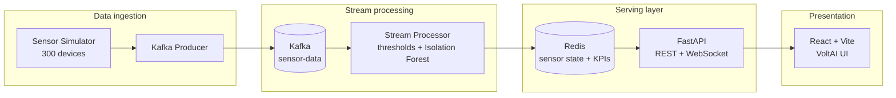

# VoltAI — IoT Energy Monitor

**Real-time industrial energy monitoring with explainable health scoring, ML anomaly detection, and tariff-aware optimization.**

[](https://www.python.org/)
[](https://fastapi.tiangolo.com/)
[](https://react.dev/)
[](https://kafka.apache.org/)
[](https://redis.io/)
[](https://scikit-learn.org/)
[](https://www.docker.com/)

> **Portfolio highlight:** End-to-end streaming pipeline — 300 simulated factory sensors → Kafka → stream processing (rules + Isolation Forest) → Redis → FastAPI + WebSockets → React dashboard.

<!-- Optional: add a demo GIF or screenshot -->
<!--  -->

---

## Why this project matters

Factories lose money when equipment runs inefficiently, fails without warning, or draws power during expensive peak tariffs. **VoltAI** demonstrates how to build a **production-style IoT analytics stack** that:

- Ingests **high-volume sensor telemetry** through a message bus
- Classifies equipment health using **research-aligned thresholds** (temperature, load %, voltage ratio, vibration, energy vs baseline, pressure)
- Augments rules with **unsupervised anomaly detection** (Isolation Forest)
- Surfaces **actionable cost savings** ($/hour) from a transparent optimization engine
- Delivers insights through a **live React operations dashboard**

Recruiters and hiring managers can skim this README for **system design**, **data/ML engineering**, and **full-stack delivery** in one repo.

---

## Key features

| Area | What you get |
|------|----------------|
| **Live monitoring** | Dashboard KPIs — total energy, active sensors, critical alerts, efficiency score, hourly cost estimates |
| **Sensor fleet** | 300 devices (motors, compressors, conveyors, furnaces, pumps, etc.) across multiple factory zones |
| **Health bands** | Per-metric LOW → CRITICAL classification with domain-aware overall status (avoids false “critical” on idle cold equipment) |
| **ML anomalies** | Isolation Forest on current, temperature, pressure; scores feed failure-risk, not opaque overrides |
| **Failure risk** | 0–100% interpretable score from worst band severity + status floor + ML boost |
| **Optimization** | Peak/off-peak load shifting, predictive maintenance, efficiency audits, night shutdown suggestions |
| **Analytics** | Time-range charts, trend %, export-friendly views |
| **Real-time UX** | WebSocket + REST polling; dark/light theme; scheduling modals aligned to tariff windows |

---

## Architecture



**Data flow (one sentence):** Simulated readings are published to Kafka, enriched and scored by the stream processor, cached in Redis with TTL, then exposed via FastAPI to the React frontend.

---

## Tech stack

| Layer | Technologies |
|-------|----------------|
| **Frontend** | React 18, Vite, Chart.js / Recharts, Axios, WebSockets, Context API, custom CSS |
| **API** | FastAPI, Uvicorn, Pydantic, CORS, OpenAPI (`/api/docs`) |
| **Streaming** | Apache Kafka (Confluent), `kafka-python` |
| **Processing** | Python, NumPy, Pandas, scikit-learn (Isolation Forest, StandardScaler) |
| **Cache / state** | Redis |
| **Infrastructure** | Docker, Docker Compose (Zookeeper + Kafka) |

---

## Project structure

```
IOT-Energy-monitor/
├── backend/
│   ├── run_producer.py          # Kafka producer entrypoint
│   ├── run_consumer.py          # Stream processor entrypoint
│   ├── run_api.py               # FastAPI entrypoint
│   └── src/
│       ├── data_simulator/      # 300-sensor telemetry generator + Kafka publish
│       ├── stream_processor/    # Thresholds + ML + Redis writes
│       ├── ml_models/           # Tariff-aware optimization engine
│       ├── sensor_thresholds.py # Research-aligned band definitions
│       └── api/                 # REST + WebSocket routes
├── frontend/
│   └── src/
│       ├── components/          # Dashboard, Sensors, Analytics, Optimization
│       ├── context/               # Energy + theme providers
│       └── utils/                 # Efficiency score, trends
├── deployment/                  # Docker Compose (Kafka stack)
├── RUN_COMMANDS.md              # Step-by-step local run guide
└── README.md
```

---

## Quick start

### Prerequisites

- [Docker Desktop](https://www.docker.com/products/docker-desktop/) (Kafka + optional Redis)
- Python 3.10+
- Node.js 18+ and npm

### 1. Infrastructure (Terminal 1)

```bash
cd deployment
export HOST_IP=127.0.0.1   # Git Bash / Linux / macOS
# Windows PowerShell: $env:HOST_IP="127.0.0.1"

docker compose -f docker-compose-producer.yml up -d zookeeper kafka
```

### 2. Redis (Terminal 2)

```bash
docker run -d --name iot-redis -p 6379:6379 redis:alpine
# If container already exists: docker start iot-redis
```

### 3. Backend services (Terminals 3–5)

```bash
cd backend
pip install -r requirements.txt

export KAFKA_BROKER=127.0.0.1:9092
export REDIS_HOST=127.0.0.1

python run_producer.py    # Terminal 3 — sensor stream
python run_consumer.py    # Terminal 4 — stream processor
python run_api.py         # Terminal 5 — API on :8000
```

### 4. Frontend (Terminal 6)

```bash
cd frontend
npm install
npm run dev
```

| Service | URL |
|---------|-----|
| **Dashboard** | http://localhost:3000 |
| **API health** | http://localhost:8000/health |
| **OpenAPI docs** | http://localhost:8000/docs |

For troubleshooting (ports, Docker, WebSocket disconnect), see **[RUN_COMMANDS.md](./RUN_COMMANDS.md)**.

---

## API overview

| Method | Endpoint | Description |
|--------|----------|-------------|
| `GET` | `/health` | API + Redis health check |
| `GET` | `/api/sensors` | All live sensor snapshots |
| `GET` | `/api/sensors/{id}` | Single sensor detail |
| `GET` | `/api/dashboard/stats` | Aggregated KPIs |
| `GET` | `/api/optimization/suggestions` | Cost-saving recommendations |
| `GET` | `/api/analytics/history` | Chart time series |
| `GET` | `/api/thresholds/spec` | Band definitions (explainability) |
| `WS` | `/ws` | Live stats push to dashboard |

---

## Technical highlights (for interviews)

### Explainable threshold bands

Metrics are classified using fixed industrial-style edges — e.g. ISO 10816–style vibration, IEC-style voltage ratio windows, load as % of rated current, and energy as % of a **time-scaled baseline** (reduces false CRITICAL flags across day/night cycles).

Overall sensor status uses **severity contributions** across metrics, not a naive “any CRITICAL → critical” rule — so idle low temperature does not automatically mean equipment failure.

### ML without black-box overrides

`IsolationForest` runs on `[current, temperature, pressure]`. Outputs (`ml_anomaly`, `anomaly_score`) **boost** failure probability; rule-based status remains auditable via `/api/thresholds/spec`.

### Optimization engine

Suggestions are computed from real sensor state:

- **Peak shaving** — shift top 25% energy consumers off on-peak ($0.18/kWh) to off-peak ($0.08/kWh)
- **Predictive maintenance** — high `failure_probability` assets
- **Efficiency audit** — sensors > 130% of fleet mean consumption
- **Night shutdown** — low-usage pumps, cooling towers, conveyors in off-hours

### Core formulas

**Energy per reading (kWh):**

```
energy_kWh = current_A × voltage_V / 1000 × power_factor
```

**Hourly cost (illustrative tariff):**

| Period | Rate ($/kWh) |
|--------|----------------|
| Off-peak | 0.08 |
| Shoulder | 0.12 |
| On-peak (9:00–17:00) | 0.18 |

```
hourly_cost = Σ (sensor_energy_kWh × rate_for_current_hour)
```

---

## Skills demonstrated

- **System design:** Decoupled ingest, process, and serve tiers; horizontal scaling path via Kafka consumer groups
- **Stream processing:** Real-time enrichment, aggregation, Redis TTL caching
- **Data science / ML:** Unsupervised anomaly detection integrated with rule engines
- **Backend engineering:** RESTful API design, WebSockets, health checks, environment-based config
- **Frontend engineering:** Real-time state management, charts, responsive ops UI, theme system
- **DevOps:** Dockerized Kafka stack, multi-service local orchestration

---

## Screenshots & demo (add for portfolio)

Replace this section with your own assets when publishing to GitHub:

1. **Dashboard** — KPI cards + live chart + critical alerts  
2. **Sensor grid** — status badges and failure risk %  
3. **Optimization** — suggestion cards with $/hour savings and schedule modal  
4. **Analytics** — energy / efficiency trends  

```bash
# Suggested: capture after all services are running
# Place images in docs/screenshots/ and uncomment the banner at the top
```

**Live demo:** _Add your deployed URL here (e.g. Vercel frontend + cloud API) if available._

---

## Configuration

| Variable | Default | Used by |
|----------|---------|---------|
| `KAFKA_BROKER` | `localhost:9092` | Producer, consumer |
| `REDIS_HOST` | `redis` / `127.0.0.1` | Consumer, API |
| `HOST_IP` | `127.0.0.1` | Kafka advertised listener (Docker) |
| `BACKEND_PROXY_TARGET` | `http://localhost:8000` | Vite dev proxy |

---

## Roadmap (optional extensions)

- [ ] Persist time-series to TimescaleDB or InfluxDB
- [ ] Grafana dashboards on Kafka/Redis metrics
- [ ] CI/CD pipeline (GitHub Actions) + containerized full stack
- [ ] Authentication (JWT) for multi-tenant factories
- [ ] Replace simulator with MQTT / OPC-UA device adapters


<p align="center">
  <strong>VoltAI</strong> — streaming IoT telemetry into explainable insights and measurable energy savings.
</p>
